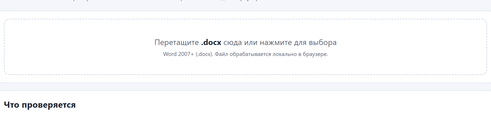
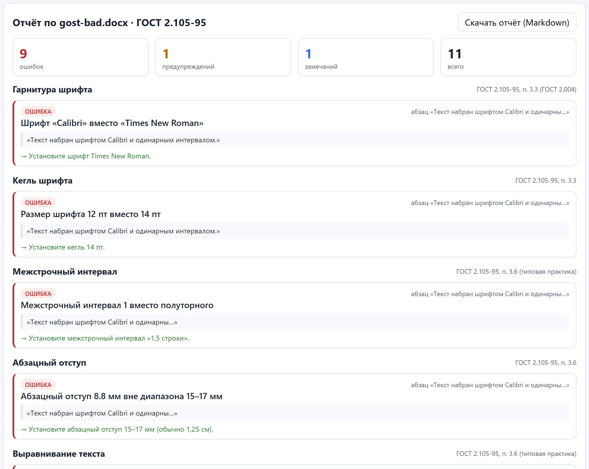
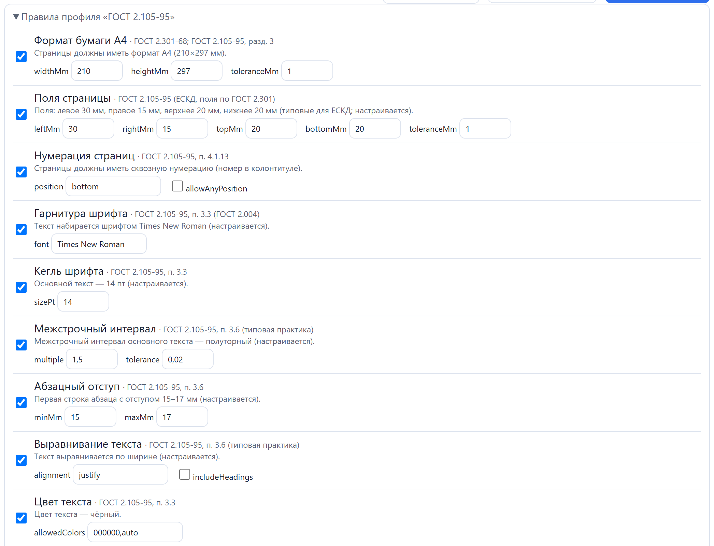

# GOST Checker

[](https://github.com/Metsubou9/gost-checker/actions/workflows/ci.yml)
[](https://github.com/Metsubou9/gost-checker/actions/workflows/deploy.yml)
[](LICENSE)
[](https://metsubou9.github.io/gost-checker/)

Проверка оформления документов **Word (.docx)** на соответствие **ГОСТ 2.105-95** «ЕСКД. Общие требования к текстовым документам» — прямо в браузере, без загрузки файлов на сервер.

> 🌐 **Демо:** [metsubou9.github.io/gost-checker](https://metsubou9.github.io/gost-checker/)

## Скриншоты

| Стартовый экран | Отчёт о проверке | Настройки правил |
|---|---|---|
|  |  |  |
| *Перетащите .docx — всё считается локально* | *Нарушения с фрагментом, пунктом ГОСТ и советом* | *Каждое правило можно настроить или отключить* |

## Что проверяется

| Группа | Правила | Пункт ГОСТ |
|---|---|---|
| Страница | Формат A4 (210×297 мм), поля (30/15/20/20 мм), номер страницы в колонтитуле | ГОСТ 2.301-68, п. 4.1.13 |
| Шрифт | Гарнитура (Times New Roman), кегль 14 пт | п. 3.3 |
| Абзацы | Полуторный интервал, отступ первой строки 15–17 мм, выравнивание по ширине, чёрный цвет | п. 3.6 |
| Заголовки | С прописной буквы, без точки в конце, без подчёркивания, без переносов; последовательная нумерация разделов/подразделов | п. 4.1.2–4.1.3, 4.1.9 |
| Структура | «Содержание» в больших документах, раздел с нового листа | п. 4.1.10–4.1.11 |
| Таблицы | Подпись «Таблица N — Название» над таблицей, последовательная нумерация | разд. 4.2 |
| Рисунки | Подпись «Рисунок N — Название» под рисунком по центру, последовательная нумерация | разд. 4.2 |
| Литература | Наличие списка, последовательная нумерация, элементы библиографического описания | п. 4.1.12, ГОСТ 7.32 |

Все значения (шрифт, кегль, поля, отступы) **настраиваются** — методички вузов и организаций различаются.

## Возможности

- 🔒 **Приватность**: файл разбирается локально (JSZip + DOMParser), ничего не отправляется в сеть
- ⚙️ Гибкая настройка каждого правила и отключение ненужных
- 📄 Отчёт с фрагментами документа, ссылкой на пункт ГОСТ и советом по исправлению
- ⬇️ Экспорт отчёта в Markdown
- 🧩 Расширяемость: новые ГОСТы — это новые «профили», новые форматы — новые «адаптеры парсера»

## Запуск

```bash
npm install
npm run dev      # http://localhost:5173
```

```bash
npm test         # vitest
npm run build    # typecheck + production build в dist/
```

## Публикация на GitHub Pages

1. Запушьте репозиторий на GitHub.
2. Settings → Pages → Source: **GitHub Actions**.
3. Workflow `deploy.yml` соберёт и опубликует сайт при каждом push в `main`.

Базовый путь уже настроен (`base: "/gost-checker/"` в `vite.config.ts`) — если назовёте репозиторий иначе, поправьте его.

## Планы (Roadmap)

- [ ] Адаптер для **.xlsx** — проверка оформления таблиц
- [ ] Профиль **ГОСТ 7.32-2017** (отчёты о НИР)
- [ ] Поддержка **.odt** (OpenDocument)
- [ ] Экспорт отчёта в **PDF**

Хотите помочь? Посмотрите раздел [«Архитектура»](#архитектура): добавить профиль, правило или формат-адаптер несложно — любой пункт выше подходит как первый вклад.

## Архитектура

```
src/
  core/       модель документа (формат-независимая), единицы, текст
  parser/     xml.ts, styles.ts, headings.ts, docx.ts  ← .docx адаптер
  rules/      движок + по файлу на правило (22 правила)
  profiles/   gost-2-105-95.ts ← профиль = набор правил + дефолты
  ui/         React-интерфейс (dropzone, настройки, отчёт, экспорт)
```

### Добавить новое правило

```ts
// src/rules/my-rule.ts
export const myRule: Rule = {
  id: "my-rule",
  title: "Моё правило",
  gostClause: "ГОСТ 2.105-95, п. …",
  severity: "warning",
  description: "…",
  defaultConfig: {},
  check: (doc, cfg) => [ /* Violation[] */ ],
};
```

Зарегистрируйте в `src/rules/index.ts` и добавьте в профиль.

### Добавить новый ГОСТ (профиль)

Создайте `src/profiles/gost-xxxx.ts`, выберите нужные правила (можно со своими `defaultConfig`) и добавьте в `PROFILES`. Следующие кандидаты: **ГОСТ 2.106-96** (рамки и основная надпись), **ГОСТ 7.32-2017** (отчёты о НИР).

### Добавить новый формат (адаптер)

Реализуйте функцию `parseXxx(file: File): Promise<ParsedDocument>` по образцу `src/parser/docx.ts` — правила заработают автоматически. Кандидаты: **.xlsx**, **.odt**, **.rtf**.

## Известные ограничения

- Проверяются свойства, извлекаемые из OOXML: наследование стилей разрешается (docDefaults → стиль → прямое форматирование), но экзотические случаи (темы, `w:style` с циклами, надписи/фигуры WordArt) могут учитываться не полностью.
- Определение «раздел с нового листа» и номеров страниц — эвристическое.
- Загружайте `.docx` (Word 2007+); старый бинарный `.doc` не поддерживается — пересохраните в Word.

## Лицензия

MIT — см. [LICENSE](LICENSE).
